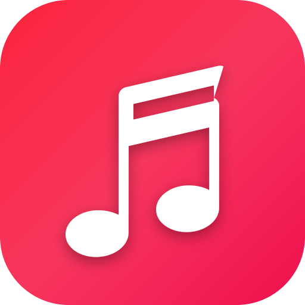

# 🎵 AppleTube — Apple Music Streaming for Android & Web

> **A sleek, ad-free music application with the iconic Apple Music interface for Android, streaming directly from the YouTube database with background playback with screen locked, 1-tap installation, and cloud sync.**

<p align="center">
  
</p>

---

## 🍎 Apple Music Android Interface

- **Apple Music Design System**: OLED true black aesthetic (`#000000`), signature Apple Music pinkish-red accent (`#fa2d48`), Apple SF Pro typography, and frosted glass materials (`backdrop-filter: blur(30px)`).
- **Iconic Apple Music Logo**: High-definition squircle with official Apple Music radiant gradient and white beamed double musical note.
- **Android Bottom Navigation Tab Bar**:
  - **Listen Now**: Personalized curated recommendations, trending hits, and genre chips.
  - **Radio**: 35,000+ uninterrupted live internet radio stations.
  - **Search**: Apple Music browse categories with vibrant gradient tiles (Bollywood, Punjabi, Global Pop, Hip-Hop, Lo-Fi, Romance, Workout, Sad, EDM, Rock, Spatial Audio) + real-time YouTube catalog search.
  - **Library**: Synced music collections, playlists, and listening history.
- **Floating Mini-Player**:
  - Floats above the bottom tab bar on Android and mobile screens (`height: 56px`, `border-radius: 14px`, OLED glass blur).
  - Shows track artwork, title, artist, and quick Play/Pause and Next buttons.
  - Top hairline progress scrubber that tracks song progression in real-time.
  - 1-Tap expands into the full Apple Music Now Playing sheet.
- **Expandable Fullscreen Now Playing Sheet**:
  - Apple Music pull-down handle (`.apple-sheet-handle`) to swipe or tap down to collapse.
  - Dynamic ambient blurred background reflecting the current album colors.
  - Rounded squircle album artwork, track details, scrubber bar with time counters.
  - Full transport controls (Shuffle, Previous, Play/Pause, Next, Repeat).
  - Quick action bar: Synced Lyrics, HD Poster, Download song, and Social Share.

---

## ✨ Features

- **YouTube Database Integration**: Search millions of songs, official tracks, and live concerts directly from YouTube's massive catalog.
- **100% Ad-Free Streaming**: Pure direct audio stream extraction (`itag=140` AAC) — zero video ads, zero audio interruptions, and zero sponsor banners.
- **True Background Playback on Android**:
  - Keep music playing in the background when you turn your phone screen off or switch to other apps (WhatsApp, Instagram, etc.).
  - Android Lock Screen & Notification media controls with high-res artwork, Play, Pause, and Skip buttons via the MediaSession API.
  - Mobile WakeLock API integration to prevent Android aggressive battery governors from stopping audio.
- **Easy 1-Tap Installation on Android Phones**:
  - Installable as a Progressive Web App (PWA WebAPK).
  - Tap "📲 Install App" in the app or scan the QR code to install directly into your Android app drawer without needing third-party stores.
- **35,000+ Live Internet Radio Stations**: Worldwide radio broadcasts running 24/7.
- **Real-Time Audio Visualizer**: Live canvas frequency spectrum and harmonic audio waves powered by the Web Audio API.
- **Mood-Based Next Music Suggestions & Smart Autoplay**: Plays same-type songs continuously (sad to sad, happy to happy, romantic to romantic) using intelligent multilingual mood scoring and YouTube InnerTube mix recommendations.
- **User Accounts & Cloud Collection Sync**: Register and sign in to sync your Liked Songs, Custom Playlists, and History across multiple devices (phone, tablet, computer) securely.
- **1-Click Music Downloads**: Download any YouTube track or audio file directly to your device as an audio file (`.m4a` / `.mp3`) for offline listening.
- **HD Music Poster & Artwork Viewer**: Click on any track's cover to view the full high-resolution YouTube poster with 1-click "Save Poster" or instant playback.
- **Enhanced Lyrics Reading Mode**: Read synchronized lyrics karaoke-style or switch to **Full Reading Mode** with adjustable font sizing (`A-` / `A+`) and 1-tap **Copy to Clipboard**.
- **Social Music Sharing**: Share any song instantly via Android's native share sheet or copy deep-links (`?song=...`) that automatically load and play for friends.
- **Personal Library & Custom Playlists**: Save liked songs with 1-click heart, create custom playlists, and manage your listening queue.
- **Local Audio Player (Drag & Drop)**: Drop your own MP3, WAV, FLAC, or AAC files directly into the app for instant playback.

---

## 📱 How to Run & Install on Android Phones

### Step 1: Start the Local Server
In your terminal, navigate to the folder and run:
```bash
./start.sh
```

The terminal will show:
```
========================================================
🎵 AppleTube — Live Music & Android Background Audio
========================================================
💻 Computer Browser:  http://localhost:3000
📱 Android Phone:     http://<your-ip>:3000
👉 Open the Android Phone URL in Chrome to install AppleTube!
========================================================
```

### Step 2: Open on Android Phone
1. Make sure your Android phone is connected to the same Wi-Fi network as your computer.
2. Open **Google Chrome** on your Android phone and visit the `http://<your-ip>:3000` address (or tap **"Phone App"** on your computer screen to scan the QR code with your phone camera).
3. Tap **"Install App"** at the top or tap the 3 dots (**⋮**) in Chrome and select **"Install app"** (or **"Add to Home screen"**).
4. AppleTube installs with the Apple Music icon directly on your home screen and app drawer!

### Step 3: Enjoy Background Playback
Play any song from YouTube, lock your phone screen or put it in your pocket — **the music keeps playing seamlessly in the background!**

---

## ⌨️ Desktop Keyboard Shortcuts

| Key | Action |
| --- | --- |
| `Space` | Play / Pause |
| `→` (Right Arrow) | Seek forward 5s (`Shift + →` for 15s) |
| `←` (Left Arrow) | Seek backward 5s (`Shift + ←` for 15s) |
| `↑` (Up Arrow) | Increase Volume 5% |
| `↓` (Down Arrow) | Decrease Volume 5% |
| `M` | Mute / Unmute |
| `L` | Toggle Lyrics View |
| `F` | Toggle Fullscreen Now Playing |
| `Esc` | Close any open drawer or overlay |

---

## 🌐 Deploy to the Cloud

You can also deploy AppleTube to free cloud hosting so you can access it anywhere without running a local server:
- **Vercel**: Run `npx vercel` or link this repo on Vercel.
- **Netlify**: Drag and drop the folder into Netlify Drop.
- **GitHub Pages**: Push this repository to GitHub and enable GitHub Pages in repo settings.
